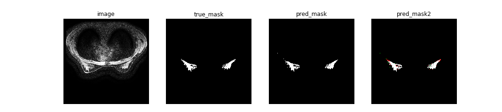
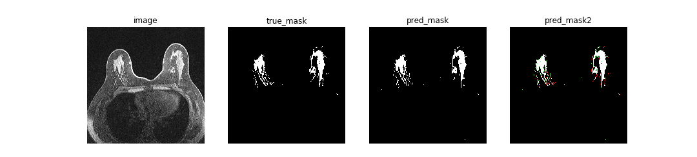
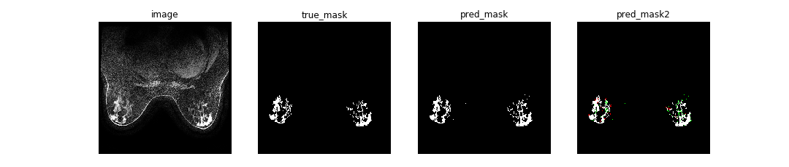
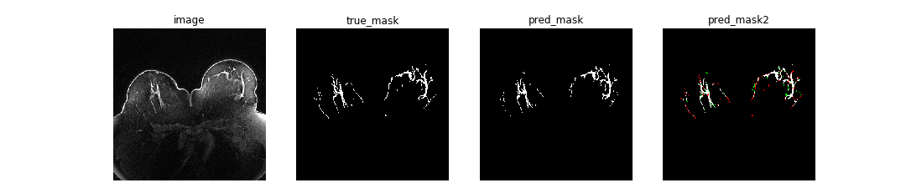
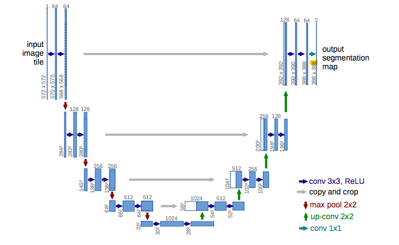

# UNet for Breast Dense Tissue Segmentation

This is the sorce code (PyTorch + Python) which employs UNet for breast density segmentation.
The breast density segmentation contains two parts: out breast segmentaiton and dense tissue segmentation.
This repository includes the trained weights which can be used for prediction or fine-tuning on a different dataset, and training code for breast segmentation and dense tissue segmentation respectively.

## Usage
**Note : Use Python 3.6 or newer**
### Pretrained model
The pretrained weights for breast segmentation are stored in `breast_train/checkpoint_breast/CP_breast.pth`.
The pretrained weights for dense tissue segmentation are stored in `dense_tissue_train/checkpoint_dense_tissue/CP_dense_tissue.pth`.

If you want to use our trained weights for prediction, you should use the same normalization method for your dataset as we do which is shown in the following Preprocessing part. 

### Preprocessing
You need to have a folder with images preprocessed using provided python code `format_conversion_and_normalization.ipynb`. 
If your MRI files and mask files are DICOM format, use step 1 to convert them to PNG format.
After having the png format dataset, use step 2 to normalize the MRIs. 
Refer to `format_conversion_and_normalization.ipynb` for more details. 

The main requirement for dataset preparation is to have image names the same as corresponding masks names (e.g. both image and the corresponding mask named <case_id>_<slice_number>.png).

### Prediction
After training your model and saving it to MODEL.pth (or download our pretrained model), you can easily test the output masks on your images or calculate the breast density on your 3D volume of slices.

#### Mask prediction for one slice
To predict images in a folder and save it:

`python predict.py -i image_folder_path/ -o save_path/ -m MODEL.pth`

#### Breast density calculation for 3D volume
To predict the breast density for one patient and print it:

`python calculate_density.py -i 3D_volume_path/  -m_d DENSE_TISSUE_MODEL.pth -m_b BREAST_MODEL.pth`

The 3D volume folder should contains all slices for that patient.
`calculate_density.py` is under folder `dense_tissue_train`.

### Training
The training script train.py has variables defined at the top that you need to set:

- `dir_img_train` - folder containing training images
- `dir_img_test` - folder containing test images
- `dir_mask_train` - folder containing training masks
- `dir_mask_test` - folder containing test masks
- `dir_checkpoint` - folder saving the model
- `dir_test_pred` - folder saving the test predictions after each epoch

**Note : images and the corresponding masks should have the same name**

Then, run the training using:

`python train.py -e num_of_epochs -b batchsize -l learning_rate`

By default, num_of_epochs is 200, batchsize is 2, learning_rate is 5e-4.

#### Tensorboard
You can visualize in real time the train and test losses, the weights and gradients, along with the model predictions with tensorboard:

`tensorboard --logdir=runs`

## Data
### Duke-Breast-Cancer-MRI
https://wiki.cancerimagingarchive.net/pages/viewpage.action?pageId=70226903

This dataset shares MRI imaging and other data for 922 patients with invasive breast cancer. Their prone position axial breast MRI images were acquired by 1.5T or 3T scanners. Following MRI sequences are shared: a non-fat saturated T1-weighted sequence, a fat-saturated gradient echo T1-weighted pre-contrast sequence, and mostly three to four post-contrast sequences. Experiment in our paper uses the fat-saturated gradient echo T1-weighted pre-contrast sequence.

### Segmentation masks
The segmentation masks (including breast masks and dense tissue masks) are available here:

## Results
The last colume 'pred_mask2' aims at better illustrating our results. White pixel represents true positive, green pixel represents false positive, red pixel represents false negative.

## U-Net architecture

The figure below shows a U-Net architecture implemented in this repository.

