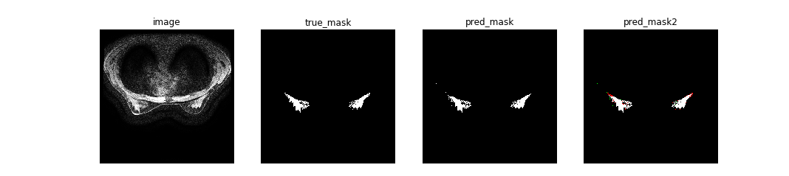
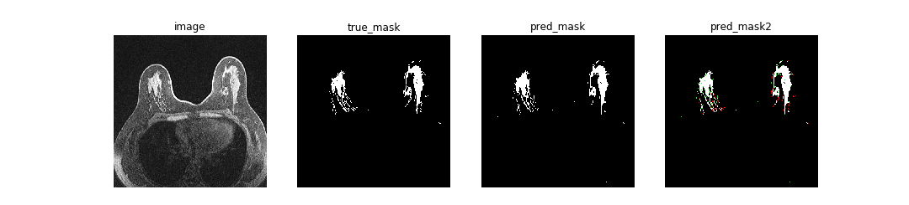
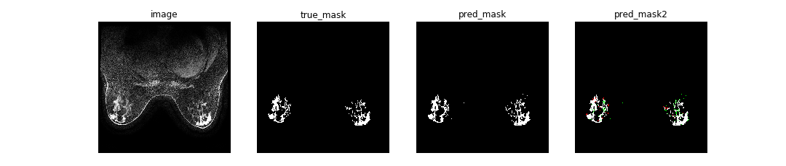
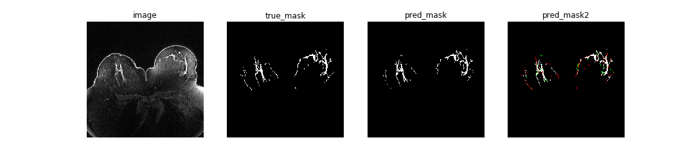

# UNet for Breast Dense Tissue Segmentation

This is the sorce code (PyTorch + Python) which employs UNet for breast density segmentation.
The breast density segmentation contains two parts: out breast segmentaiton and dense tissue segmentation.
This repository includes the trained weights which can be used for inference or fine-tuning on a different dataset, and training code for breast segmentation and dense tissue segmentation seperately.

## Usage
**Note : Use Python 3.6 or newer**
### Pretrained model
The pretrained weights for breast segmentation are stored in 'breast_train/checkpoint_breast/CP_breast.pth'.
The pretrained weights for dense tissue segmentation are stored in 'dense_tissue_train/checkpoint_dense_tissue/CP_dense_tissue.pth'.

If you want to use our trained weights for inference, you should use the normalization method which is shown in the following Preprocessing part. 

### Preprocessing

### Prediction

### Training

#### Tensorboard

## Data
### Duke-Breast-Cancer-MRI
https://wiki.cancerimagingarchive.net/pages/viewpage.action?pageId=70226903

This dataset shares MRI imaging and other data for 922 patients with invasive breast cancer. Their prone position axial breast MRI images were acquired by 1.5T or 3T scanners. Following MRI sequences are shared: a non-fat saturated T1-weighted sequence, a fat-saturated gradient echo T1-weighted pre-contrast sequence, and mostly three to four post-contrast sequences. Experiment in our paper uses the fat-saturated gradient echo T1-weighted pre-contrast sequence.

### Segmentation masks
The segmentation masks (including breast masks and dense tissue masks) are available here:

## Results

## U-Net architecture

The figure below shows a U-Net architecture implemented in this repository.

